

  
  

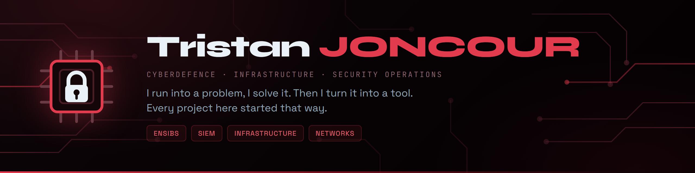

  
  
  

Engineering student in **cyberdefence** at **ENSIBS**, in Vannes, France, working part-time in an infrastructure team alongside my studies.

I moved towards security for a simple reason: I like understanding how a system works, spotting where it gives way, and finding what it takes to hold it together. I came up through development, system administration, networking and security, and it is that whole picture that interests me today, rather than any single tool.

**When a constraint keeps coming back, I write the thing that makes it go away.** Most of the projects below started exactly like that: an attendance sheet to click every week, a hairdresser friend running his appointments over text messages, passwords scattered around with no vault to trust them to.

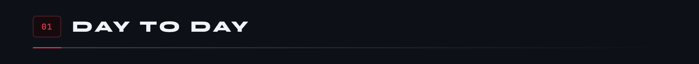

Running and analysing security logs through a **SIEM**, event detection, configuration audits, system administration and network work.

Alongside that, my personal and academic projects push me deeper into **Python**, **Linux**, **applied cryptography** and security. What I enjoy is the step from theory to practice: understand the problem, experiment, analyse, then harden what is already there.

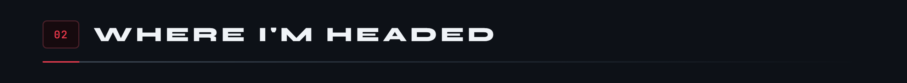

When I finish my engineering degree, in **September 2027**, I am aiming for **Luxembourg**, with **three years of work-study experience** in infrastructure and security behind me.

I am looking at roles in **cybersecurity**, **infrastructure**, **security operations** and **systems and network engineering**. To keep learning, build real expertise, and contribute to the security of information systems.

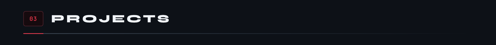

<a href="https://github.com/Microcoaster">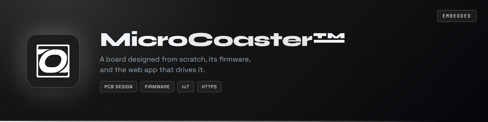</a>

<a href="https://github.com/Cybertrist/Serenity">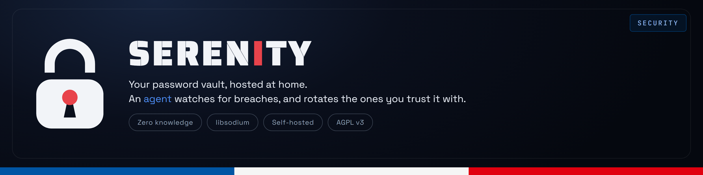</a><a href="https://github.com/Cybertrist/Messagerie-securise-RSA-AES">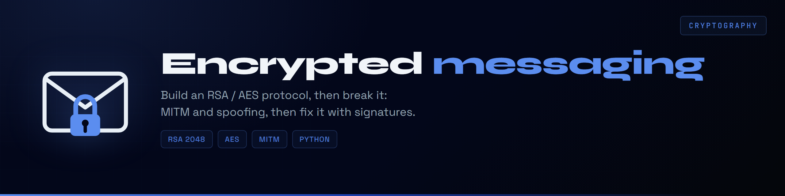</a>
<a href="https://github.com/Cybertrist/DIR-ASM">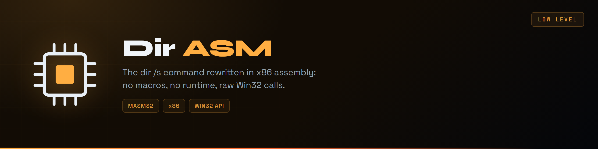</a><a href="https://github.com/Cybertrist/Huffman">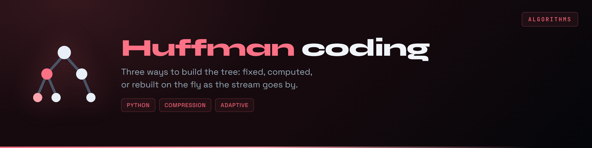</a>
<a href="https://github.com/Cybertrist/BeVannes">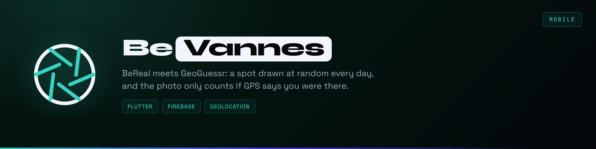</a><a href="https://github.com/Cybertrist/ubhess-emargement">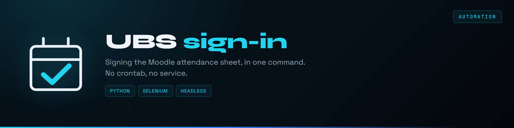</a>
<a href="https://github.com/Cybertrist/KyrlCut">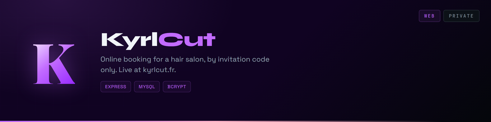</a>
<a href="https://github.com/Cybertrist/GoMuscu">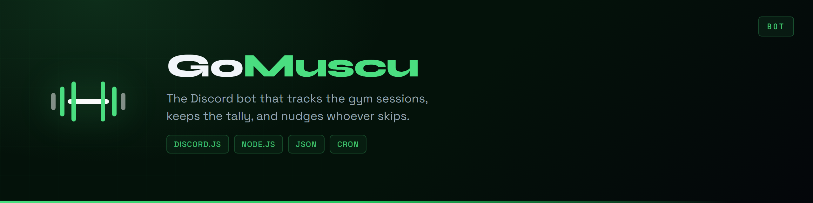</a><a href="https://github.com/Cybertrist/Basicfit-Coach">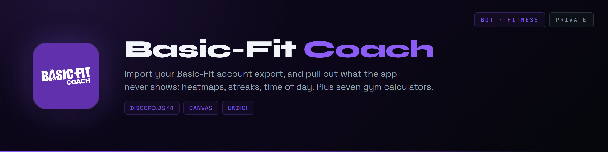</a>
<a href="https://github.com/Cybertrist/Basicfit-Securite">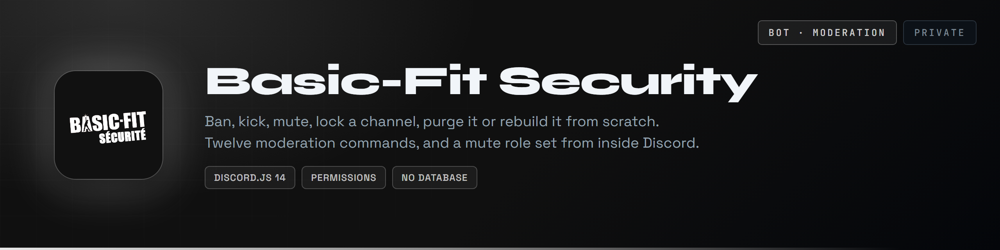</a><a href="https://github.com/Cybertrist/Basicfit-Manager">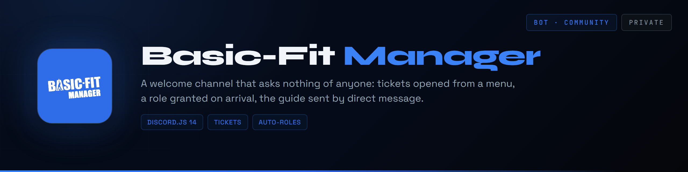</a>
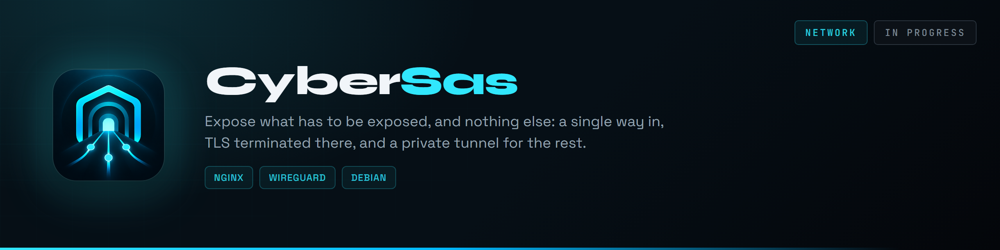

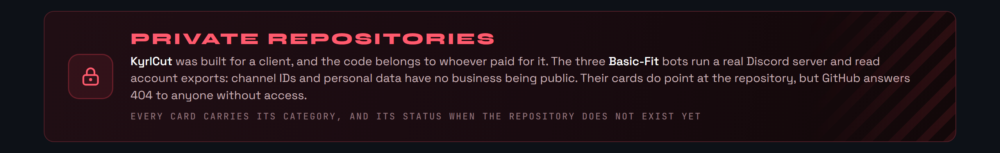

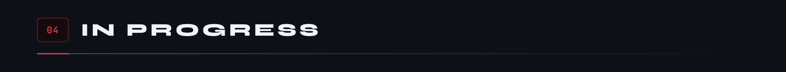

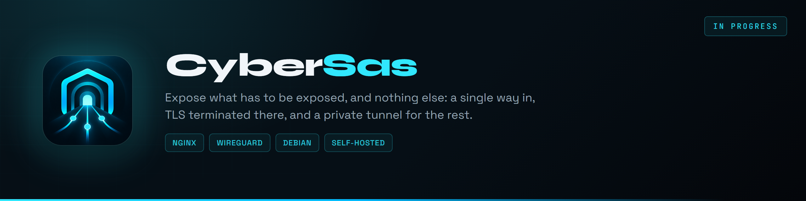

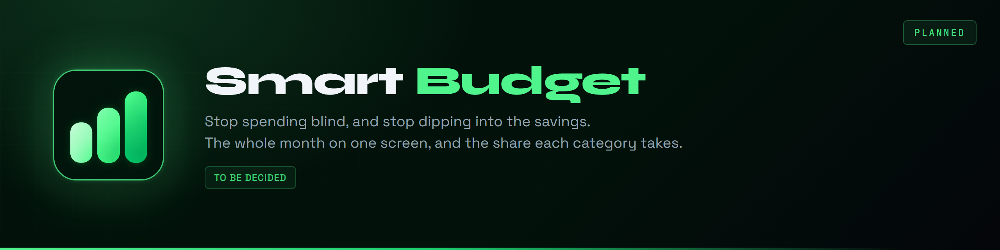

<a href="https://github.com/Cybertrist/BodyCount">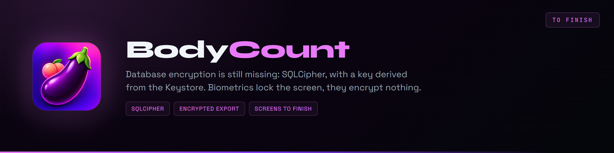</a>

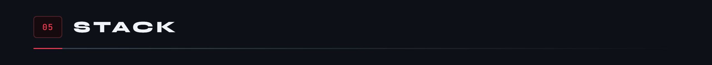

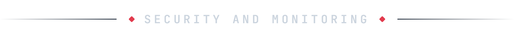

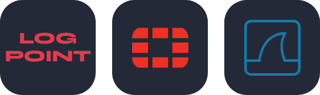

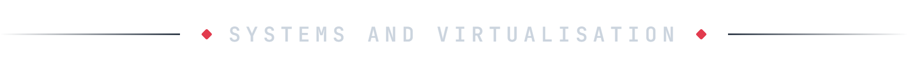

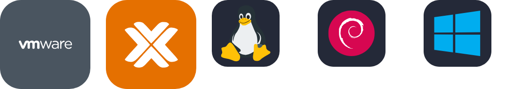

  
  &nbsp;&nbsp;&nbsp;
  
  &nbsp;&nbsp;&nbsp;
  
  &nbsp;&nbsp;&nbsp;
  

  

