

  <a href="README.md"><picture><source media="(prefers-color-scheme: light)" srcset="docs/clair/langues/fr-off.png"></picture></a>
  <picture><source media="(prefers-color-scheme: light)" srcset="docs/clair/langues/en-on.png">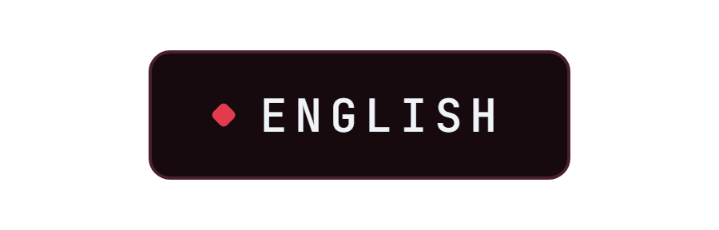</picture>

<picture><source media="(prefers-color-scheme: light)" srcset="docs/en/clair/banniere.png">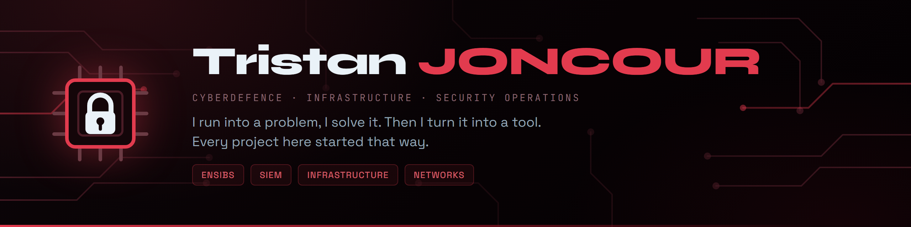</picture>

  <picture><source media="(prefers-color-scheme: light)" srcset="https://img.shields.io/badge/ENSIBS-Cyberdefence%20Engineering-F6F8FA?style=for-the-badge&logo=akamai&logoColor=D02A3F&labelColor=EAEEF2"></picture>
  <picture><source media="(prefers-color-scheme: light)" srcset="https://img.shields.io/badge/Vannes-Brittany-F6F8FA?style=for-the-badge&logo=googlemaps&logoColor=D02A3F&labelColor=EAEEF2"></picture>
  <picture><source media="(prefers-color-scheme: light)" srcset="https://img.shields.io/badge/Luxembourg-September%202027-F6F8FA?style=for-the-badge&logo=target&logoColor=D02A3F&labelColor=EAEEF2"></picture>

Engineering student in **cyberdefence** at **ENSIBS**, in Vannes, France, working part-time in an infrastructure team alongside my studies.

I moved towards security for a simple reason: I like understanding how a system works, spotting where it gives way, and finding what it takes to hold it together. I came up through development, system administration, networking and security, and it is that whole picture that interests me today, rather than any single tool.

**When a constraint keeps coming back, I write the thing that makes it go away.** Most of the projects below started exactly like that: a budget melting away without me seeing it go, passwords scattered around with no vault to trust them to.

<picture><source media="(prefers-color-scheme: light)" srcset="docs/en/clair/sections/quotidien.png">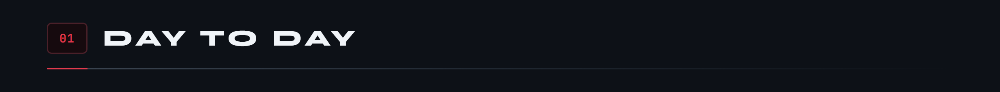</picture>

Running and analysing security logs through a **SIEM**, event detection, configuration audits, system administration and network work.

Alongside that, my personal and academic projects push me deeper into **Python**, **Linux**, **applied cryptography** and security. What I enjoy is the step from theory to practice: understand the problem, experiment, analyse, then harden what is already there.

<picture><source media="(prefers-color-scheme: light)" srcset="docs/en/clair/sections/objectif.png">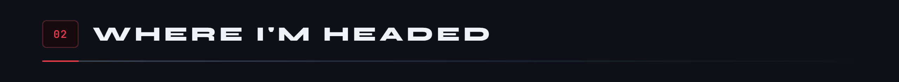</picture>

When I finish my engineering degree, in **September 2027**, I am aiming for **Luxembourg**, with **three years of work-study experience** in infrastructure and security behind me.

I am looking at roles in **cybersecurity**, **infrastructure**, **security operations** and **systems and network engineering**. To keep learning, build real expertise, and contribute to the security of information systems.

<picture><source media="(prefers-color-scheme: light)" srcset="docs/en/clair/sections/projets.png">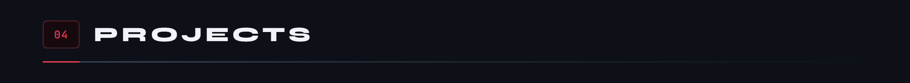</picture>

<a href="https://github.com/Cybertrist/Aesthetic/blob/main/README.en.md"><picture><source media="(prefers-color-scheme: light)" srcset="docs/en/clair/projets/aesthetic.png">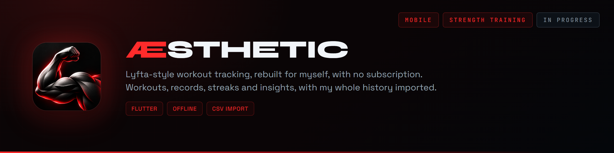</picture></a>

<a href="https://github.com/Cybertrist/BeVannes/blob/main/README.en.md"><picture><source media="(prefers-color-scheme: light)" srcset="docs/en/clair/projets/bevannes.png">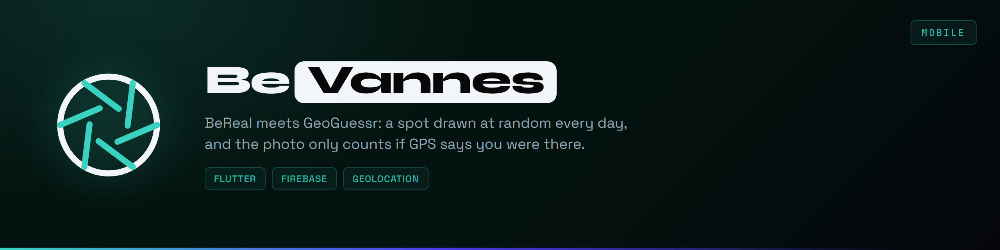</picture></a>

<a href="https://github.com/Cybertrist/BodyCount/blob/main/README.en.md"><picture><source media="(prefers-color-scheme: light)" srcset="docs/en/clair/projets/bodycount.png">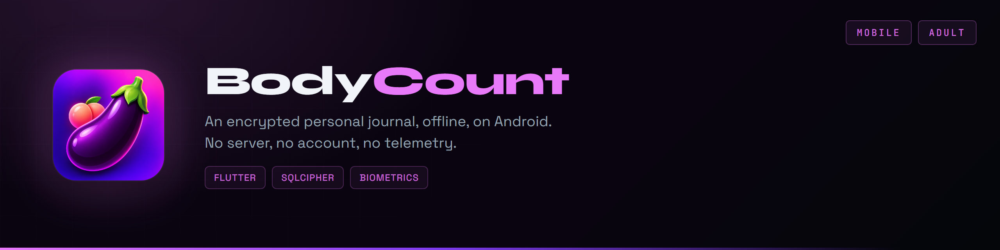</picture></a>

<a href="https://github.com/Cybertrist/CyberSas"><picture><source media="(prefers-color-scheme: light)" srcset="docs/en/clair/projets/cybersas-vpn.png">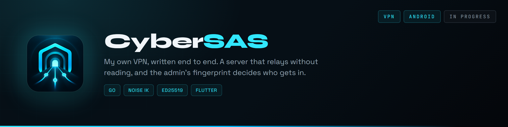</picture></a>

<a href="https://github.com/Cybertrist/KyrlCut/blob/main/README.en.md"><picture><source media="(prefers-color-scheme: light)" srcset="docs/en/clair/projets/kyrlcut.png">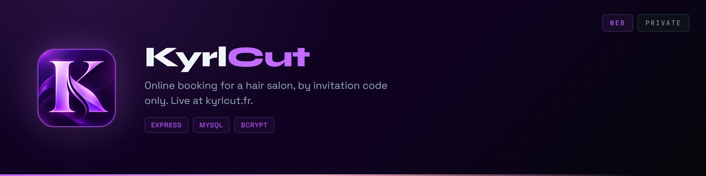</picture></a>

<a href="https://github.com/Microcoaster"><picture><source media="(prefers-color-scheme: light)" srcset="docs/en/clair/projets/microcoaster-carte.png">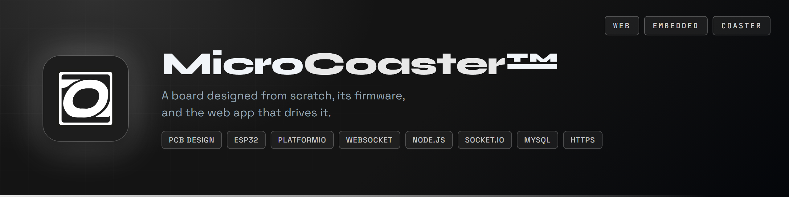</picture></a>

<a href="https://github.com/Cybertrist/Serenity/blob/main/README.en.md"><picture><source media="(prefers-color-scheme: light)" srcset="docs/en/clair/projets/serenity.png"></picture></a>

<a href="https://github.com/Cybertrist/SmartBudget"><picture><source media="(prefers-color-scheme: light)" srcset="docs/en/clair/projets/smartbudget.png">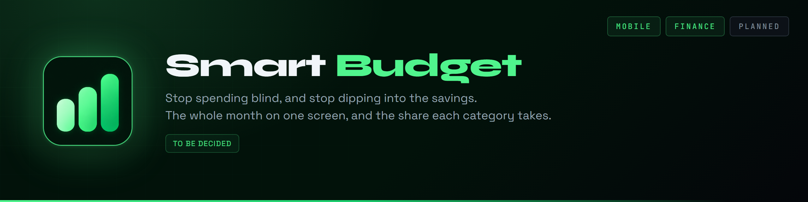</picture></a>

<picture><source media="(prefers-color-scheme: light)" srcset="docs/en/clair/sections/stack.png">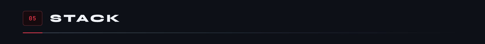</picture>

<picture><source media="(prefers-color-scheme: light)" srcset="docs/en/clair/stack/lab-securite.png">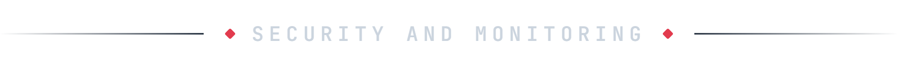</picture>

<picture><source media="(prefers-color-scheme: light)" srcset="docs/en/clair/stack/lab-systemes.png">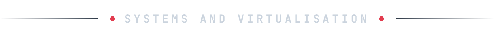</picture>

<picture><source media="(prefers-color-scheme: light)" srcset="docs/en/clair/stack/lab-microsoft.png"></picture>

<picture><source media="(prefers-color-scheme: light)" srcset="docs/en/clair/stack/lab-exploitation.png"></picture>

<picture><source media="(prefers-color-scheme: light)" srcset="docs/en/clair/stack/lab-langages.png"></picture>

<picture><source media="(prefers-color-scheme: light)" srcset="docs/en/clair/stack/lab-web.png"></picture>

<picture><source media="(prefers-color-scheme: light)" srcset="docs/en/clair/stack/lab-donnees.png">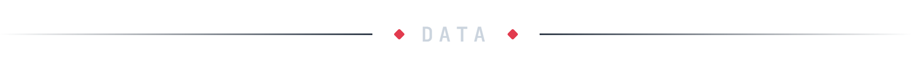</picture>

<picture><source media="(prefers-color-scheme: light)" srcset="docs/en/clair/stack/lab-embarque.png"></picture>

<picture><source media="(prefers-color-scheme: light)" srcset="docs/en/clair/stack/lab-assistants.png"></picture>

<picture><source media="(prefers-color-scheme: light)" srcset="docs/en/clair/sections/contact.png"></picture>

  
  &nbsp;&nbsp;&nbsp;
  
  &nbsp;&nbsp;&nbsp;
  
  &nbsp;&nbsp;&nbsp;
  

  <a href="mailto:tristanjoncour29@gmail.com"><picture><source media="(prefers-color-scheme: light)" srcset="docs/clair/liens/adresse.png"></picture></a>

