

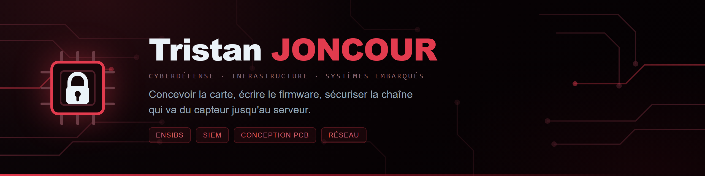

  
  
  

Élève ingénieur en **cyberdéfense** à l'**ENSIBS**, à Vannes, en alternance dans une équipe d'infrastructure technique.

Je me suis orienté vers la sécurité pour une raison simple : j'aime comprendre comment un système fonctionne, repérer où il cède, et trouver ce qu'il faut pour qu'il tienne. Mon parcours m'a fait passer par le développement, l'administration système, le réseau et la sécurité, et c'est cette vision d'ensemble qui m'intéresse aujourd'hui, plutôt qu'un outil isolé.

**Quand une contrainte revient trop souvent, j'écris ce qui la fait disparaître.** La plupart des projets ci-dessous sont nés comme ça : un émargement à cliquer chaque semaine, un ami coiffeur qui gérait ses rendez-vous par messages, des mots de passe éparpillés sans coffre à qui les confier.

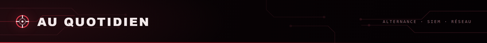

Exploitation et analyse des journaux de sécurité avec un **SIEM**, détection d'événements, audit de configurations, administration système et problématiques réseau.

En parallèle, mes projets personnels et académiques me font creuser **Python**, **Linux**, la **cryptographie appliquée** et la sécurité. Ce qui me plaît, c'est le passage de la théorie à la pratique : comprendre le problème, expérimenter, analyser, puis sécuriser l'existant.

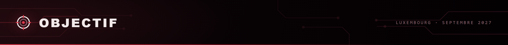

À l'issue de mon cursus d'ingénieur, en **septembre 2027**, je vise le **Luxembourg**, fort de **trois années d'alternance** en infrastructure et en sécurité.

Je m'intéresse aux postes en **cybersécurité**, **infrastructure**, **sécurité opérationnelle** et **ingénierie des systèmes et réseaux**. Continuer à apprendre, gagner en expertise, et contribuer à la sécurité des systèmes d'information.

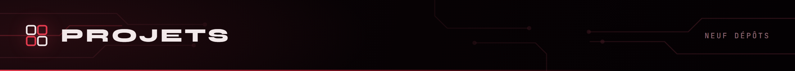

<a href="https://github.com/Microcoaster">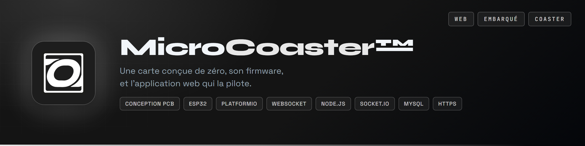</a>

<a href="https://github.com/Cybertrist/Serenity">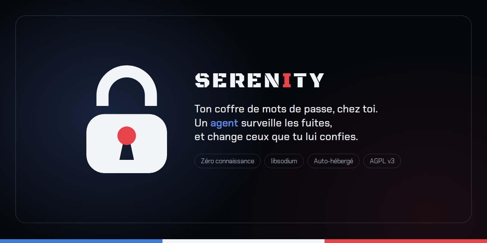</a><a href="https://github.com/Cybertrist/Messagerie-securise-RSA-AES">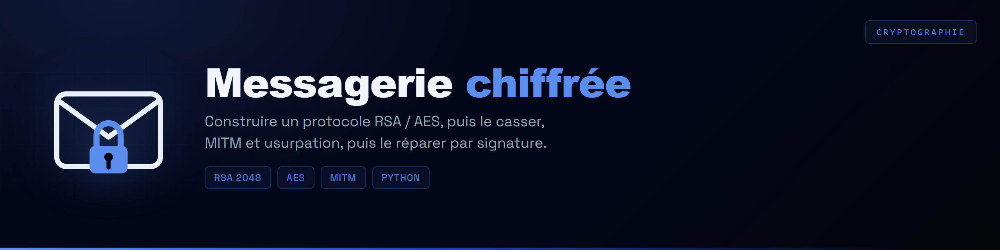</a>
<a href="https://github.com/Cybertrist/DIR-ASM">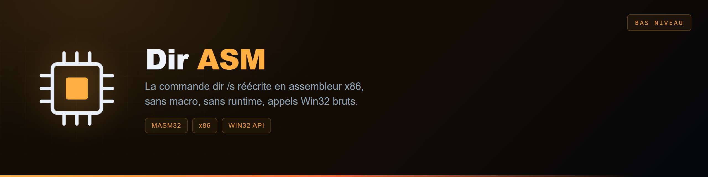</a><a href="https://github.com/Cybertrist/Huffman">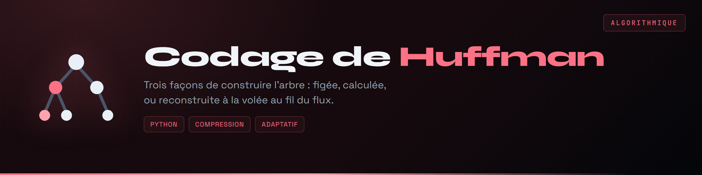</a>
<a href="https://github.com/Cybertrist/BeVannes">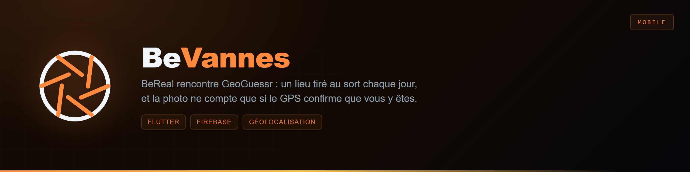</a><a href="https://github.com/Cybertrist/ubhess-emargement">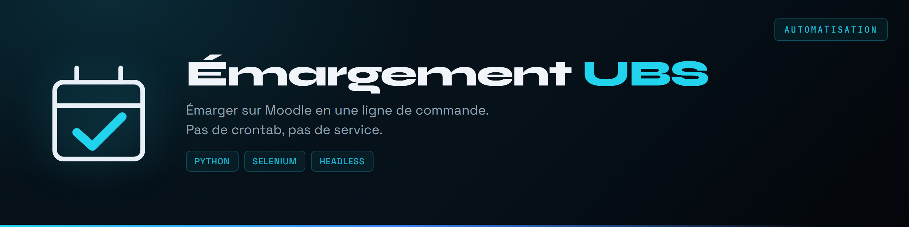</a>
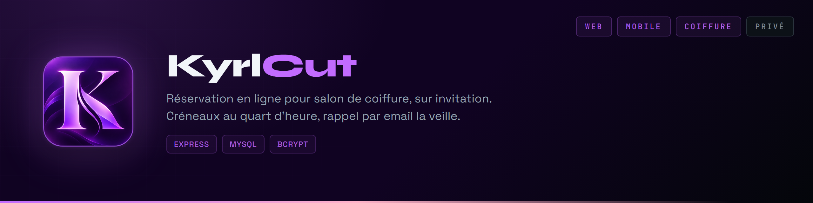
<a href="https://github.com/Cybertrist/GoMuscu">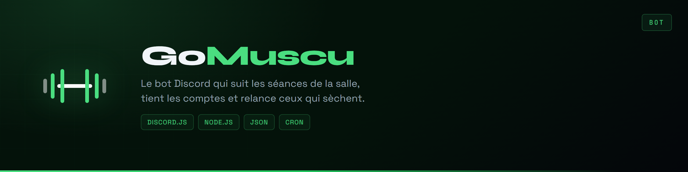</a>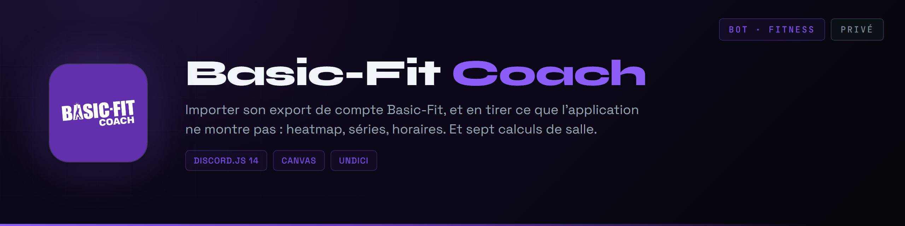
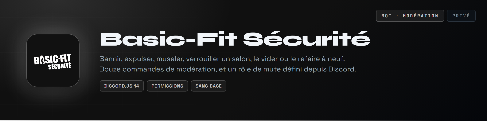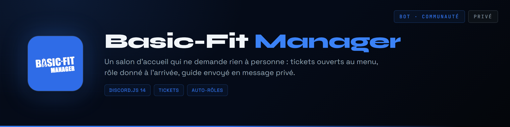

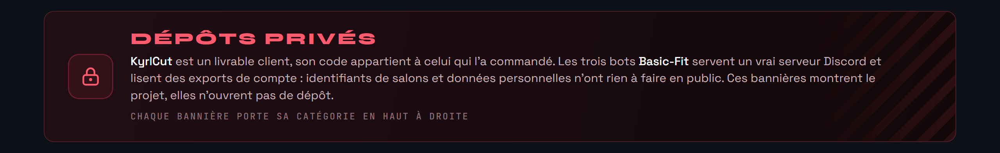

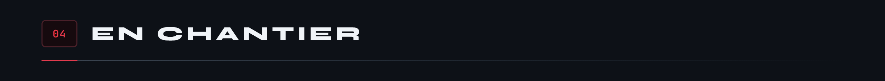

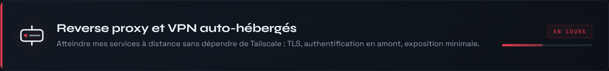

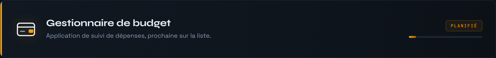

<a href="https://github.com/Cybertrist/BodyCount">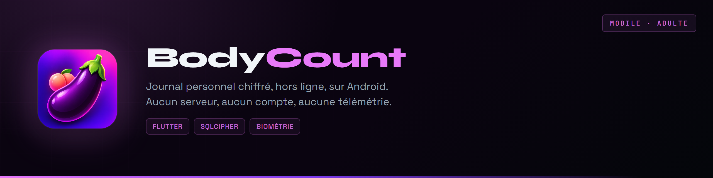</a>

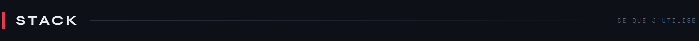

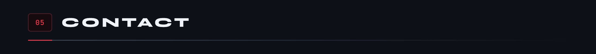

  
  &nbsp;&nbsp;&nbsp;
  
  &nbsp;&nbsp;&nbsp;
  
  &nbsp;&nbsp;&nbsp;
  

  

