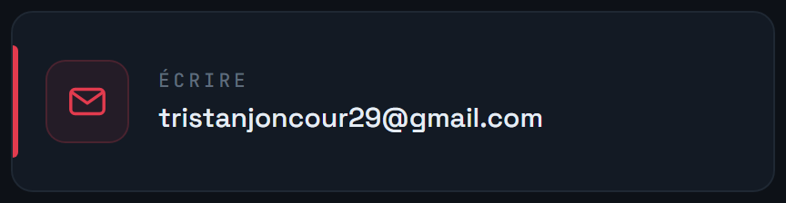
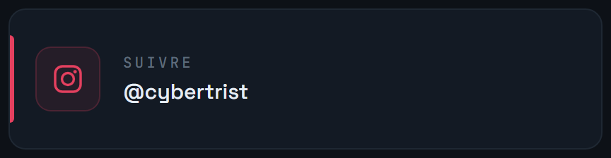

Élève ingénieur en **cyberdéfense** à l'**ENSIBS**, à Vannes, en alternance dans une équipe d'infrastructure technique.

Je me suis orienté vers la sécurité pour une raison simple : j'aime comprendre comment un système fonctionne, repérer où il cède, et trouver ce qu'il faut pour qu'il tienne. Mon parcours m'a fait passer par le développement, l'administration système, le réseau et la sécurité, et c'est cette vision d'ensemble qui m'intéresse aujourd'hui, plutôt qu'un outil isolé.

**Quand une contrainte revient trop souvent, j'écris ce qui la fait disparaître.** La plupart des projets ci-dessous sont nés comme ça : un émargement à cliquer chaque semaine, un ami coiffeur qui gérait ses rendez-vous par messages, des mots de passe éparpillés sans coffre à qui les confier.

Exploitation et analyse des journaux de sécurité avec un **SIEM**, détection d'événements, audit de configurations, administration système et problématiques réseau.

En parallèle, mes projets personnels et académiques me font creuser **Python**, **Linux**, la **cryptographie appliquée** et la sécurité. Ce qui me plaît, c'est le passage de la théorie à la pratique : comprendre le problème, expérimenter, analyser, puis sécuriser l'existant.

À l'issue de mon cursus d'ingénieur, en **septembre 2027**, je vise le **Luxembourg**, fort de **trois années d'alternance** en infrastructure et en sécurité.

Je m'intéresse aux postes en **cybersécurité**, **infrastructure**, **sécurité opérationnelle** et **ingénierie des systèmes et réseaux**. Continuer à apprendre, gagner en expertise, et contribuer à la sécurité des systèmes d'information.

Projet mené au sein de l'organisation <a href="https://github.com/Microcoaster"><b>MicroCoaster</b></a> (<a href="https://microcoaster.com">microcoaster.com</a>) : conception des PCB, firmware ESP32 des modules, gestionnaire Wi-Fi et application web de pilotage.

<table align="center">
<tr>
<td width="50%"></td>
<td width="50%"></td>
</tr>
<tr>
<td width="50%"></td>
<td width="50%"></td>
</tr>
<tr>
<td width="50%"></td>
<td width="50%"></td>
</tr>
<tr>
<td width="50%"></td>
<td width="50%"></td>
</tr>
</table>

Chaque bannière porte sa catégorie en haut à droite. KyrlCut est marqué <b>privé</b> : c'est un livrable client, son code reste fermé.

**Serenity** est le projet sur lequel je mets le plus d'exigence. Le serveur ne voit jamais rien en clair : dérivation Argon2id, chiffrement XChaCha20-Poly1305 côté client via libsodium. Un agent autonome surveille les fuites connues et fait tourner les mots de passe compromis, sous liste blanche et coupe-circuit. 163 tests Python, 43 TypeScript, et 8 jobs de CI par pull request dont un exercice de restauration qui détruit vraiment un coffre jetable.

Les trois premières lignes sont ce que je pratique en alternance, le reste vient des projets ci-dessus.

